# Volleyball Song Remixer
___
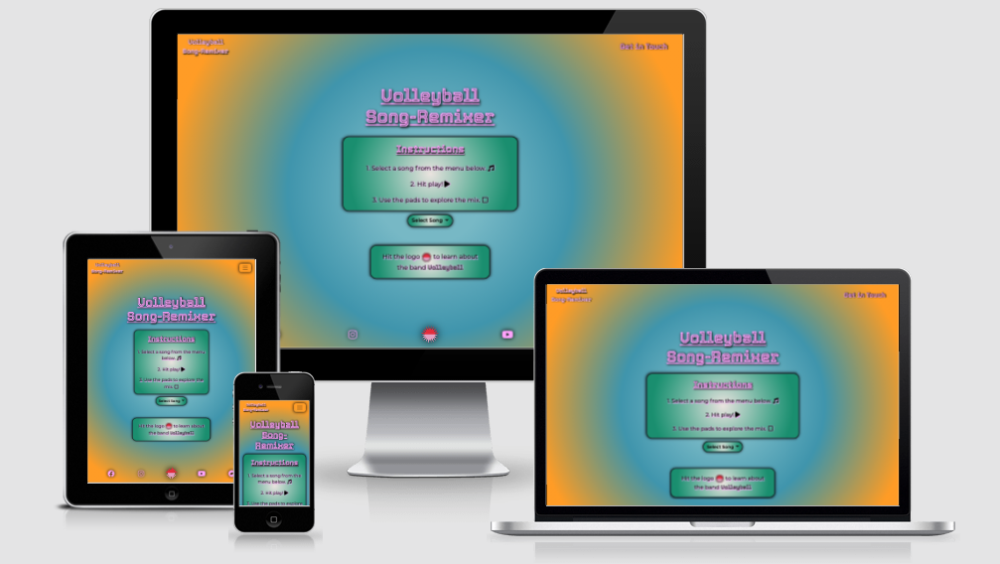

## Project Synopsis

Song remixer game using music by the band Volleyball. The user can choose from several songs and mute or hear a variety of instruments to create unique arrangements of the tracks.

[See the live site here!](https://timmorrisdev.github.io/MS2-song-remixer/)

___
## User Experience (UX)

### User Stories

- I want to easily understand the game and how to play.
- I want to remix different songs by bringing elements of the track in and out.
- The site should be visually appealing and well laid out, with different colour themes for each song.
- I want to be able to connect with the band featured on their social media and own website.

### Business Goals

- To allow fans the opportunity to create their own versions of the bands songs.
- To drive traffic to the band's social media and website to increase fan engagement.

### Design

- Colour Scheme

    So that thie site would fit with the band image, I used one of the band's social media posts of artwork for one of the songs featured to generate a palette using [Coolors](https://coolors.co/). I then used the 'generate' palette function to search for palettes that I felt fitted with the bands image, which is fairly colourful and phsycadelic.

    I also chose to find two contrasting palettes for each song to offer the user a 'light' or 'dark' theme option for each song.

    The palettes I chose were: 
    [Landing / Contact](https://github.com/TimMorrisDev/MS2-song-remixer/blob/main/assets/ux/colour-schemes/MS2-main.pdf), 
    [Aloosh 'Light'](https://github.com/TimMorrisDev/MS2-song-remixer/blob/main/assets/ux/colour-schemes/MS2-aloosh-light.pdf), 
    [Aloosh 'Dark'](https://github.com/TimMorrisDev/MS2-song-remixer/blob/main/assets/ux/colour-schemes/MS2-aloosh-dark.pdf), 
    [Escape 'Light'](https://github.com/TimMorrisDev/MS2-song-remixer/blob/main/assets/ux/colour-schemes/MS2-escape-light.pdf), 
    [Escape 'Dark'](https://github.com/TimMorrisDev/MS2-song-remixer/blob/main/assets/ux/colour-schemes/MS2-escape-dark.pdf).

- Fonts
    - Tourney / Montserrat.

        I used Tourney for any headers across the site as I felt the style fitted with the band image. I then used Montserrat for more detailed text across the site as it has good readability and a clean style. 

- Wireframes
    - [Landing / Game Page](https://github.com/TimMorrisDev/MS2-song-remixer/blob/main/assets/ux/wireframes/Home.pdf)

    - [Contact Us](https://github.com/TimMorrisDev/MS2-song-remixer/blob/main/assets/ux/wireframes/contact.pdf)
   
## Features
### Landing page / instructions
This page is designed to clearly guide the user through the basic instructions for the game and prompt song selection.

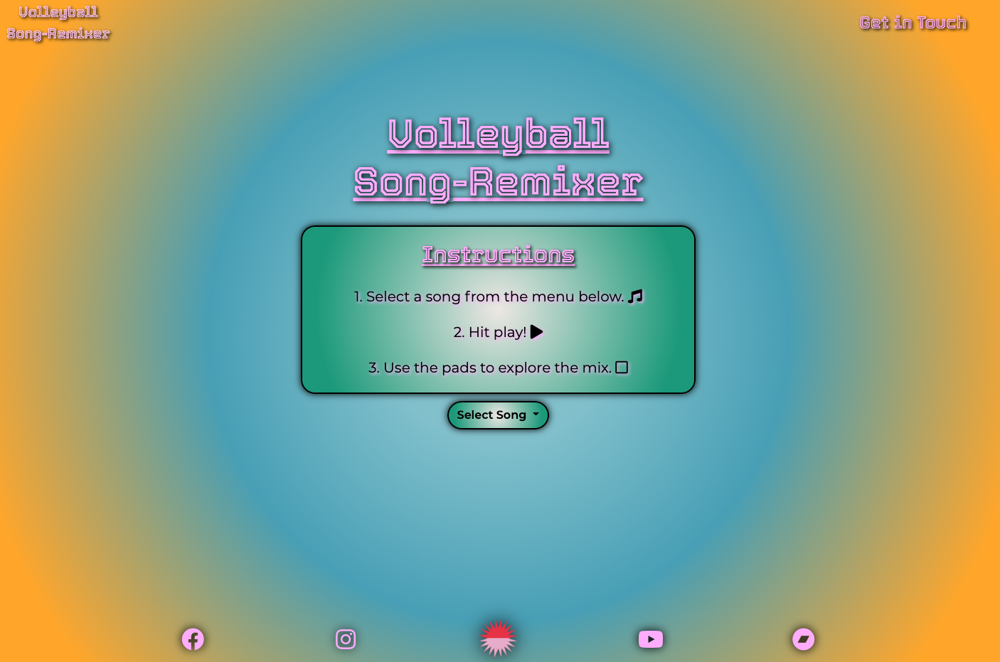
### Song selector
The song selector button allows the user to pick between the two songs 'Aloosh' and 'Escape'. This action delivers the song information to songRemixer.JS, which is used to determine the parameters of most functions across the site. 

### Game view
The main game view is comprised of easy-to-read pads that allow the user to manipulate what instruments are being heard in the song.

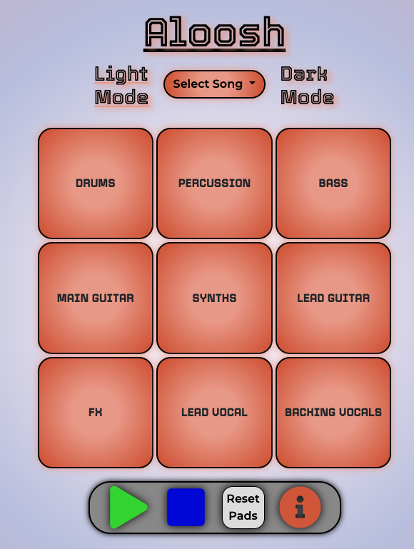
### Transport bar
This section allows the user to play or pause the song, skip back to the beginning, or manipular the pads being heard on a global level to the song. There is also a more detailed version of the instructions available if the user needs further guidance.

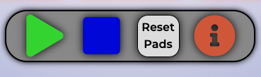
### Expanded instructions
Linked from the 'transport bar' this offers the user more detailed game instructions if required.

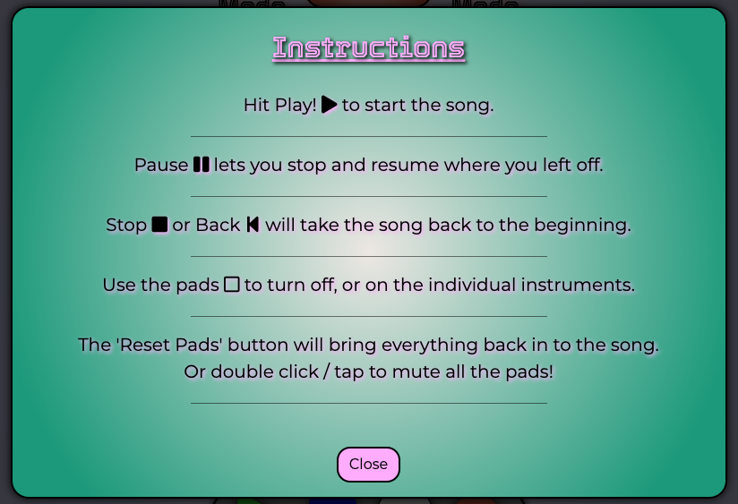
### Contact Page
I included a contact page on the site so that I can gather any feedback from the users to inspire future development goals.

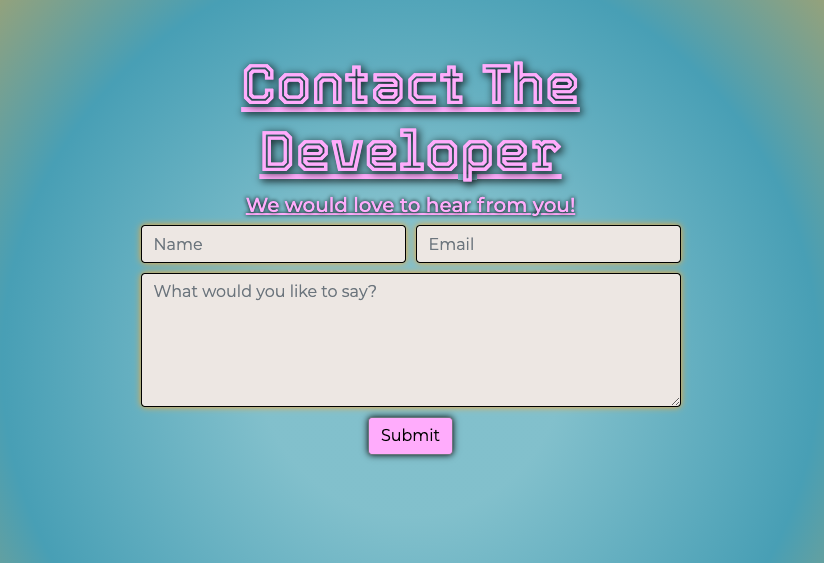

### Other features
- Responsive across all devices and screen sizes.
- Adaptive to modify content shown to be appropriate for user device or screen size.

### Design Decisions Made During Development

### Future Development Opportunities
- Recording of arrangements

    In the furture I would like to develop a 'back-end' aspect to the site that might allow users to capture and subsequently share their unique mixes of the song via social media. This would have the goal of increasing game enjoyment for the user and also increase the effectiveness of the game as a promotional tool for the band.

- Additional processing options

    I would like to include the ability to further manipulate the different parts of each song. Perhaps adding individual volume / EQ / reverb settings. This could be a 'paid' feature to allow the band to generate revenue with the app.

___
## Technologies Used
### Languages Used
- [HTML5](https://en.wikipedia.org/wiki/HTML5)
- [CSS3](https://en.wikipedia.org/wiki/CSS)
- [JavaScript](https://www.javascript.com/)

### Frameworks, Libraries & Programs Used
- [HowlerJS](https://howlerjs.com/)
    - HowlerJS was used to intergrate audio on the site. It utilises mostly the web audio API with fall back to HMTL5 audio where compatibility is an issue. I chose to use audiosprites for each song as I kept my file management neater and helped assure simultainious playback for each element of the song arrangements.

- [Audioprite Generator](https://github.com/tonistiigi/audiosprite)

    - I installed audiosprite using the npm package in my mac terminal. I then used the terminal to generate a stereo audiosprite for each songn in both mp3 and webm formats so HowlerJS can select the best for any particular device / browser. I chose to use audiosprites for the composit parts of the songs rather than individuual files to help ensure the intended playback when certain browsers or devices force falling back to HTML5 audio for playback.

- [jQuery](https://jquery.com/)
    - I used jQuery in my Javascript code for the song remixer game. I mostly made use of event handlers to intergrate user interaction with the site with my Javascript functions controlling the features ofered to the user.
    - jQuery was also used as part of Bootstrap and is used for Javascript plugins such as the responsive nav bar and modals.

- [Bootstrap](https://getbootstrap.com/docs/4.5/getting-started/introduction/)
    - Bootstrap was used for the responsive 'grid'. Code snippets from the Bootstrap documentation were used in various places and modified to suit the purpose and design of the site.
- [EmailJS](https://www.emailjs.com/)
    - 
- [Google Fonts](https://fonts.google.com/)
    - Google Fonts was used to import the 'Montserrat', 'Lato' and 'Quicksand' fonts, which were used throughout the site.
- [Font Awesome](https://fontawesome.com/)
    - Used to source images for the transport section of the remixer.

- [Git](https://git-scm.com/)
    - Git was used for version control using the terminal in Gitpod to 'add' and 'commit' to Git and to push changes to the GitHub repository using 'git push'.

- [Gitpod](https://gitpod.io/)
    - Gitpod.io was used as the primary development environment when coding for the site. It's terminal was used to preview the site via temporary server, and for version control using Git commands.
- [Github](https://github.com/)
    - GitHub was used to store the code pushed from Gitpod and as deployment for the [published site.](https://timmorrisdev.github.io/MS2-song-remixer/)
- [Balsamiq](https://balsamiq.com/)
    - Balsamiq was used to create the wireframes for the site while in the 'skeleton' stage of my UX process.
- [Autoprefixer](http://autoprefixer.github.io/)
    - Autoprefixer was used in the final stage of development to parse CSS code and add vendor prefixes.
- [Coloors.co](https://coolors.co/)
    - Used to source colour palettes used throughout the site.
- [CSS Gradient](https://cssgradient.io/)
    - Used to generate background radial gradient effects.
- [Am I Responsive?](http://ami.responsivedesign.is/#)
    - Used to check responsiveness acorss differenct device sizes. 

___
## Testing
### Responsiveness Testing
I used google dev tools throughout the development process to check responsiveness across different screen sizes. 

I was also sure to deploy the site to GitHub pages early in development to allow for review of the live site on various devices throughout the process.

### W3C Markup, CSS Validation & JSHint Validation
I used the W3C Markup, CSS Validator and JSHint Validator Services to check and validate each page throughout the site to check for errors. 
#### [Markup Validation Service](https://validator.w3.org/)
The validator found the following issues for me to address.
- Element hr not allowed as child of element ol in this context.
    - This was due to my nesting of hr elements within my game-instruction modal unordered list. I modified my code to include 'border-bottom' styling for each list item to rectify the issue.

#### [CSS Validation Service](https://jigsaw.w3.org/css-validator/)
My CSS file style.css passed through the w3 validator with no errors.

#### [JSHint Validation Service](https://jshint.com/)
The validator found the folowing warnings for me to address. 
- 'Function declarations should not be placed in blocks. Use a function expression or move the statement to the top of the outer function.'
    - This was caused by my addition of a setTimeout function to the buildPads function to allow for the 'cascading' effect while the pads are populating the game area. I had not removed the original function from within the setTimeout, which was now not needed. 
    - Whilst this issue was fixed there is still a warning stating: 
    
        "Functions declared within loops referencing an outer scoped variable may lead to confusing semantics. (currentSongId, i)"

        As I am using the reference outer scoped variables to apply styles and parameters based on the song selected, it is my understanding that this warning can be ignored for the purpose of this site.
- One undefined variable - Howl.
    - This is in fact not a variable but a reference to the 'Howl' class constructor used by HowlerJS. It is my understanding that the validator does not recognise the external, HowlerJS library being used and therefore I can ingore this warning for the purpose of this site.
- One unused variable - stopBtn.
    - At the top of my code, I have declared variables for various DOM elements I was likely to need to reference throughout the project. I had not needed to reference stopBtn and therefore it needed to be removed to pass validation.

### Lighthouse Testing
Lighthouse testing on the main website game page found the following issues.
- 'Links do not have a discernible name'.
    - I am using icons in my footer links and therefore had no text to acy as description. This was solved by adding the 'aria-label' attribute to each anchor tag with a short description. 

- Heading elements are not in a sequentially-descending order (contact.html).
    - This is a minor issue that I chose to ingore for the purpose of the site.

Once this issue was resolved, lighthouse testing returned the following results:

Main game page.

Contact page.

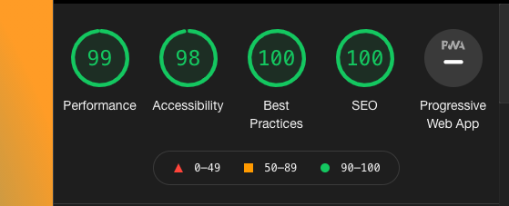

### Testing UX user stories

- I want to easily understand the game and how to play.
    - There are clear and simple instructions presented on the landing page. 
    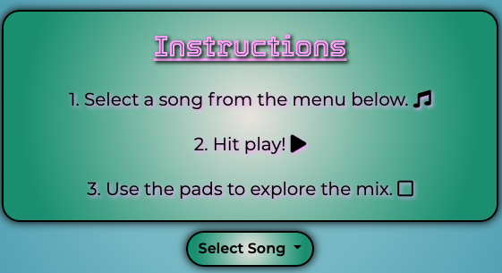
    There is also the option to reveal more detailed game instructions if required by hitting the info button in the transport bar of the main game page. 
    

- I want to remix different songs by bringing elements of the track in and out.
    - By using the clearly-labelled pads on the main game page. I was able to manipulate which instruments were being heard in the mix of the song. It was easy to see which instruments were not being heard as the pad became 'greyed-out' when that instrument was muted.
    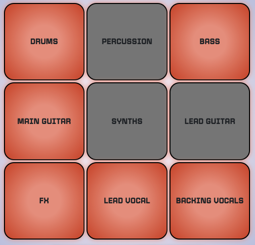

- The site should be visually appealing and well laid out, with different colour themes for each song.
    - The game area is clearly modified for each song with defined themes that suit the bands image. There are also 'light' and 'dark' mode toggles so that the user can further customise their experience. 

    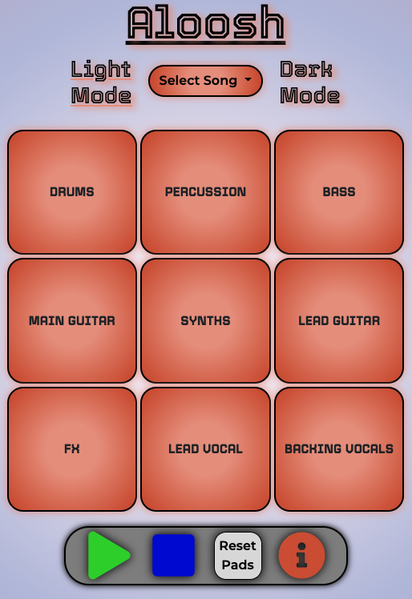

    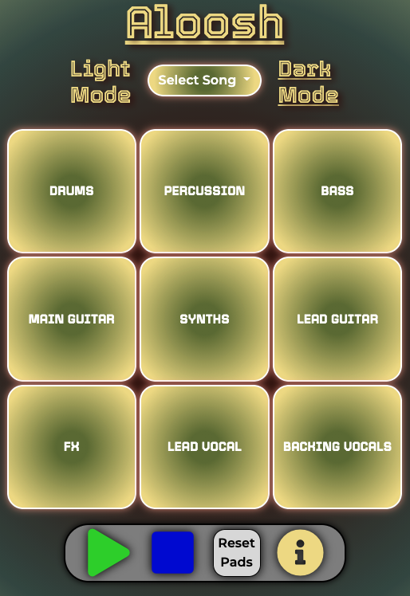
    
    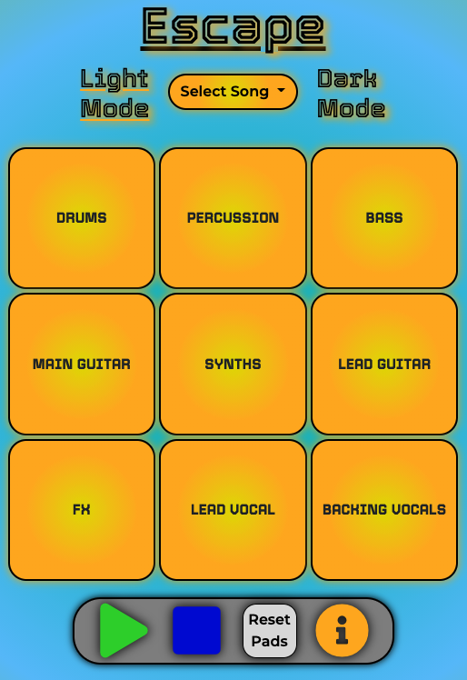

    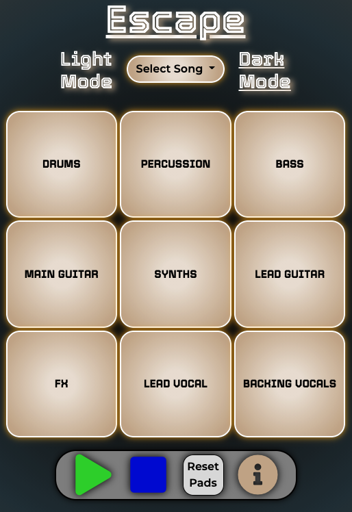

- I want to be able to connect with the band featured on their social media and own website.
    - Link to the bands social media pages, as well as their website were clear and easy to find in the footer of the page.
    

### Peer Code Review

### Cross-Browser/Device Testing
I tested the site across multiple devices using different browsers.
- Browsers tested
    - Chrome
    - Safari
    - Firefox

- Devices tested
    - Mac Pro w/ Dell 24 inch monitor
    - Macbook Pro 15 inch
    - iPhone 12
    - iPad air 2
___
## Deployment
### GitHub Pages
The project was deployed to GitHub pages using the following method. 
1. Log in to [GitHub.com](https://github.com/) and locate the [MS2-song-remixer repository](https://github.com/TimMorrisDev/MS2-song-remixer) in my account.
2. Select the repo 'settings' menu and navigate to the 'pages' tab on the left hand side.
3. In the 'source' section, select the master branch as the source for the site deployment. 
4. Hit 'save' and wait a few minutes for GitHub to process. The 'pages' settings tab will now show a message to confirm the repository is being published to the address https://timmorrisdev.github.io/MS2-song-remixer/.

### Forking the repository in GitHub
Forking the repository creates a copy of the original repository in your own account to allow changes to be made without affecting the original repository.
1. Log in to GitHub and navigate to the GitHub repository page [here](https://github.com/TimMorrisDev/MS2-song-remixer).
2. In the top-right of the page, below the user avatar, locate the "fork" button.
3. Click the "fork" button and you should now have a copy of the repository in your own account. 

### Making a Local Clone
Details of how to make a local copy of the GutHub repository can be found [here](https://docs.github.com/en/github/creating-cloning-and-archiving-repositories/cloning-a-repository). To clone using HTTPS follow these steps.
1. Navigate to the GitHub repository [here](https://github.com/TimMorrisDev/MS2-song-remixer).
2. Click the "Code" drop-down menu above the list of files.
3. Copy the HTTPS address to the clipboard using the button provided.
4. Open Terminal.
5. Change the current directory to the location you wish to copy the directory.
6. Type 'git clone' and then paste the HTTPS url you copied earlier. 
7. Press enter and your local clone will be created. 

___
## Credits
### Code
- Inspiration for player features and layout from [Traversy Media](https://www.youtube.com/watch?v=QTHRWGn_sJw) and [Junior Developer Central](https://www.youtube.com/watch?v=jZL9gVwxO-U) YouTube videos.
- Responsive grid for pads taken from [Stack Overflow article](https://stackoverflow.com/questions/46548987/a-grid-layout-with-responsive-squares) and modified to suit the site needs.
- General information about class constructors and class inheritance from [The Net Ninja 'object oriented JavaScript'](https://www.youtube.com/watch?v=4l3bTDlT6ZI&list=PL4cUxeGkcC9i5yvDkJgt60vNVWffpblB7) YouTube series.
- Information relating to [HowlerJS](https://howlerjs.com/) gathered from [Techlahoma YouTube video](https://www.youtube.com/watch?v=isCQptdu1Kg).
- Code for audio 'Howls' copied from [HowlerJS](https://howlerjs.com/) documentaion ['AudioSprite' demo](https://github.com/goldfire/howler.js#documentation) and then edited to fit the needs of the site. 
- [Stack Overflow](https://stackoverflow.com/), [w3 Schools](https://www.w3schools.com/) & [CSS tricks](https://css-tricks.com/) were used throughout the project to research solutions to site requirements.

### Content
- All content written by the developer.

### Media
- All music written by, and copyright of the band Volleyball.

### Acknowledgements
- Thanks to my mentor, Can Sucullu for all your guidance and support.
